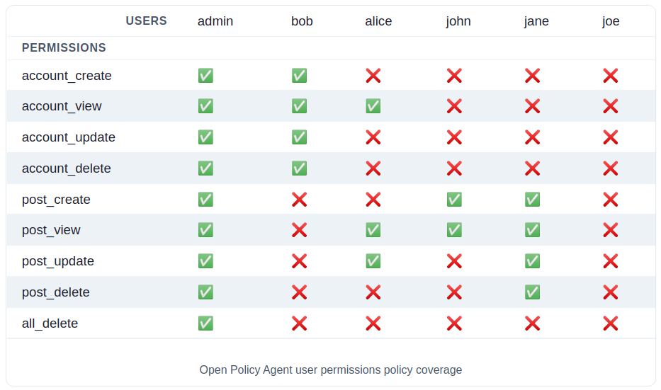

# Open Policy Agent (OPA) Policy Coverage Matrix

The repository contains a proof-of-concept implementation of the [Open Policy Agent (OPA)](https://www.openpolicyagent.org/) policy coverage visualization. Each condition from 2D matrix is being sent to OPA and the result is later presented using a table built with [React](https://reactjs.org/). The OPA policy can be further tuned and the coverage will update accordingly.

As an example, the current setup imitates a system where each user has a role and the role has a set of permissions. The system has a set of policies that define the permissions for each role. Nevertheless, this could be reused in a different context. However, it is currently limited to a two dimensional data set.

## Requirements

   - [Docker-compose](https://docs.docker.com/compose/install/)

## Getting Started

```bash
# Download require container images
docker-compose pull

# Build initial React application image
docker-compose build


# Start services
docker-compose up -d

# Monitor service logs
docker-compose logs -f
```

Web based user interface will be available at [http://localhost:3000](http://localhost:3000)

The OPA policy is located in [./policy](./policy) directory. The bundle also includes a [data.json](./policy/data.json) file with user to group membership information. The OPA service is being started with `--watch` flag meaning that it does not require a manual reload after each policy change. However, the front-end does not monitor for policy changes and would required to reload a browser page after policy gets updated.

The users and permissions displayed in the table are taken from [user.json](./src/users.json) and [permissions.json](./src/permissions.json) files.

## User Permissions Matrix

The initial coverage matrix will look as the following:



Feel free to tweak the policy rules, group memberships and users to test different scenarios.

## References

- [Dockerhub: openpolicyagent/opa](https://hub.docker.com/r/openpolicyagent/opa)
- [Running OPA](https://www.openpolicyagent.org/docs/latest/#running-opa)
- [awesome-opa](https://github.com/anderseknert/awesome-opa)
- [Charka UI](https://chakra-ui.com/docs/getting-started)
